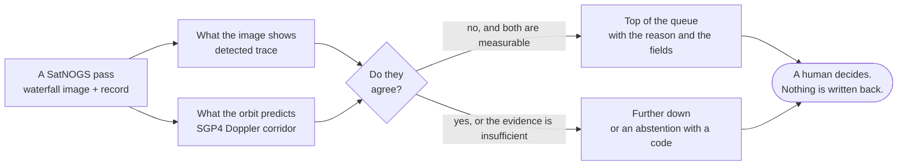

<div align="center">


# TraceTriage

### Which satellite passes are worth a reviewer's time.

**A read-only, physics-conditioned review queue for public SatNOGS radio observations.**

[](https://github.com/Kesav2k04/tracetriage-august-2026/actions/workflows/ci.yml)
[](https://tracetriage.vercel.app/)
[](https://tracetriage.vercel.app/start/)
<br>
[](docs/BOB_BUILD_LOG.md)
[](pipeline/tracetriage/granite.py)
[](apps/web/app/globals.css)
[](docs/USE_WITH_YOUR_AGENT.md)

**[Live console](https://tracetriage.vercel.app/)** &nbsp;·&nbsp;
**[Judges start here](https://tracetriage.vercel.app/start/)** &nbsp;·&nbsp;
**[For judges, in the repo](FOR_JUDGES.md)** &nbsp;·&nbsp;
**[Presentation film, narrated](presentation/out/tracetriage-film.mp4)** &nbsp;·&nbsp;
**[Point your own agent at it](docs/USE_WITH_YOUR_AGENT.md)**

*AI Builders Challenge with IBM Bob · August 2026 · theme: Advance Space Exploration with AI*

</div>

---

## At a glance

|  |  |
|---|---|
| **What it is** | A ranked, read-only review queue over public SatNOGS satellite radio observations. It reads the waterfall image and the orbital physics together, works out which unreviewed passes would teach a reviewer the most, and puts them in order. It writes nothing back. A human still decides. |
| **The problem it serves** | Of 600 observations sampled from this snapshot, **426 carry no decisive human verdict at all**. Ground-station networks are how university and cubesat missions are actually operated, and an unreviewed pass is telemetry nobody read. |
| **What the AI does** | IBM Granite 3.1 8B, run locally, writes the reviewer's first sentence, and a grounding checker throws away 15 of every 25 drafts. Granite embeddings retrieve precedents. Five read-only MCP tools take a local agent from **2 of 24 correct to 22 of 24**. |
| **What holds without a gate** | Three results that needed no verdict to come back a particular way. Granite answers **22 of 24** evidence questions with the five read-only tools and **2 of 24** without, one-sided exact p = 1e-06 over 20 discordant pairs. The grounding checker catches **525 of 525** planted falsehoods (21 drafts across each of 25 packets) and refuses **0 of 175** clean drafts (7 across each of 25). On ground stations the queue was never fitted to, lift is **2.253x** and the gate **PASSES**. |
| **The pre-registered result** | Queue lift **1.582x**, 95% CI [1.353, 1.740], reported **NOT ESTABLISHED** because the interval contains the 1.5 threshold. On held-out stations the same queue reaches **2.253x** and **PASSES**. Both are published at the same size. |
| **How IBM Bob was used** | Primary development tool. **10 dated Bob-account units** built the data contracts, the frozen snapshot, the waterfall parser, the physics corridor, the grouped splits and the review-value queue. `docs/BOB_BUILD_LOG.md` names each one with its files, commits, failures and repairs. |
| **What makes it unusual** | Six kill gates with numeric thresholds were written down **before anything was measured**, and a gate is met only when a 95% interval clears its threshold, so a point estimate above the bar whose interval straddles it is published as a failure. Every gate that is not met carries a computed reason and an exact condition that would close it. |
| **Whether it scales** | Measured, with its limits stated. The dominant *measured* stage is the corridor fit, at **68,702 observations a day on one core**, against **6,380** a day from the network: **10.8x** headroom. Read the caveats the receipt itself lists rather than the multiple: the network rate is extrapolated from a **9.4-hour** capture span so it is one observation of that rate and not a long-run average, the timing covers the corridor fit and second-trace survey only, and the core count is a division rather than a measured parallel speed-up. `artifacts/THROUGHPUT_RECEIPT.json`. |
| **Check it in 60 seconds** | `pip install -e .` then `tracetriage triage 14740031`, which measures an observation recorded today against the same physics the queue ranks on. Sixty seconds is a warm pip cache; a cold one needs one online install first. |

**Everything a judge needs to score this is mapped, twice.** The
[start page](https://tracetriage.vercel.app/start/) is the console version and
[`FOR_JUDGES.md`](FOR_JUDGES.md) is the repository version. Neither can drift from the
numbers it quotes, by two different mechanisms rather than one: `FOR_JUDGES.md` is written
by `scripts/sync_for_judges.py` from the receipts, and the start page reads them through
`apps/web/lib/data.ts`, which `scripts/build_console_data.py` generates from the same
receipts. `scripts/gate.py` carries a row for each and fails if either drifts.

## What the submission asks for, and where it is

| Required | Section |
|---|---|
| Problem statement | [Problem statement](#problem-statement) |
| Solution description | [Solution description](#solution-description) |
| AI approach and architecture | [AI approach and architecture](#ai-approach-and-architecture) |
| Selected challenge theme | [Selected challenge theme](#selected-challenge-theme) |
| How IBM Bob was used | [How IBM Bob was used](#how-ibm-bob-was-used) |
| Working prototype | [Live console](https://tracetriage.vercel.app/), and `tracetriage triage` for a live measurement |
| The judged criteria, one by one | [`FOR_JUDGES.md`](FOR_JUDGES.md), and row by row below |

Each judged criterion has its own heading rather than a page to search:

| Criterion | Answered in |
|---|---|
| Technical Execution | [`FOR_JUDGES.md`](FOR_JUDGES.md#technical-execution), and the [pipeline table](#ai-approach-and-architecture) |
| Innovation | [`FOR_JUDGES.md`](FOR_JUDGES.md#innovation) |
| Challenge Fit | [Selected challenge theme](#selected-challenge-theme), then [`FOR_JUDGES.md`](FOR_JUDGES.md#challenge-fit) |
| Implementation and Feasibility | [`FOR_JUDGES.md`](FOR_JUDGES.md#implementation-and-feasibility), and [Setup](#setup) |
| Real-World Impact | [`FOR_JUDGES.md`](FOR_JUDGES.md#real-world-impact) |

---

## What it decides, in one picture



The ten-stage pipeline that implements this is
[further down](#ai-approach-and-architecture), drawn from the tree by a script that refuses
to draw a box until the module and the receipt it names both exist.

---

## The gap this ranks on

Both rows below are published SatNOGS waterfalls, unmodified on the left and annotated on
the right by `scripts/a3_doppler_investigation.py`. The record cannot tell them apart. The image
can.

<table>
<tr>
<td width="50%"></td>
<td width="50%"></td>
</tr>
<tr>
<td><b>14746118, corrected.</b> The trace is a straight vertical line: 54.2 sigma against
7.3 for the swept curve. The station's software had already removed the Doppler shift
before writing the image, and nothing in the observation record says so.</td>
<td><b>14740031, uncorrected.</b> The trace follows the predicted curve across about 16 kHz:
25.1 sigma against 2.8 for the best vertical line. The same fields, the same client,
the opposite convention.</td>
</tr>
</table>

A detector that assumes one of these two shapes is wrong on the other half of the corpus,
and the observation record gives it no way to choose. That is the gap this queue ranks on.

Full method, margins and open questions: **`docs/DOPPLER_CORRECTION_FINDING.md`**.

---

## Problem statement

The SatNOGS network publishes hundreds of thousands of ground-station radio observations of
satellites. Each one produces a waterfall image, a spectrogram of received power over
frequency and time, and volunteers review these by eye to decide whether a satellite was
actually heard.

There are far more observations than there is human attention. In a 600-observation sample
measured on 2026-08-16, **71% carried no decisive human waterfall verdict at all** (426 of
600 were `unknown`; see `docs/SATNOGS_API_RECON.md`). The backlog is not a storage problem.
It is an attention-allocation problem.

A student researcher or a volunteer reviewer with a fixed budget of, say, forty minutes
faces one concrete decision: **which observations, out of thousands, deserve those forty
minutes?** Reviewing in arrival order spends the budget on the easy and the
already-obvious. What is worth a human's time is the subset where the evidence disagrees
with itself: the image looks like signal but the orbital geometry says the satellite was
below the horizon, or the network label says nothing was heard but a trace sits exactly
where physics predicts it.

## Selected challenge theme

**Advance Space Exploration with AI.** The theme asks for solutions that turn data-heavy
space operations into insight-driven ones and make space more accessible. SatNOGS is open,
volunteer-run space infrastructure whose bottleneck is human review capacity. Spending
scarce reviewer attention where it changes an outcome is directly that problem.

## Solution description

TraceTriage ranks a read-only review queue over observations that already exist. Each row
carries an evidence card showing:

- the waterfall image as published
- the **expected corrected-centre corridor**, the frequency band where a real signal from
  that satellite should appear, computed from the observation's own stored TLE, station
  coordinates, timing and receiver metadata
- the detected trace and its residual against that corridor
- artifact-quality checks, and the current SatNOGS label with where that label came from
- a calibrated confidence score, or an explicit **abstention with a reason code** when the
  evidence is not sufficient

The queue puts disagreement and uncertainty at the top, subject to duplicate control and
station and transmitter diversity so a single noisy station cannot flood the budget.

**What this system will never do.** It does not vote on SatNOGS, does not change any public
label, does not schedule or control a station, and does not hold a write credential. It
does not claim confirmed satellite identity, decoded telemetry, mission success, or
official endorsement. The permission boundary is specified in
`docs/ACTOR_AND_PERMISSION_CONTRACT.md` and enforced by test, not by convention.

The strongest statement this project is permitted to make, once and only once the evidence
exists, is:

> On a frozen chronological sample of public SatNOGS observations, TraceTriage concentrated
> independently reviewable label or physics conflicts near the top of a fixed review budget
> while abstaining when the evidence was insufficient.

## AI approach and architecture

The design principle is that **every layer must earn its place through an ablation**. A
component that does not improve calibration or queue utility gets deleted, not defended.


The diagram is generated by `scripts/build_architecture_diagram.py`, which refuses to draw a
box until the module and the receipt that box names both exist in the tree, and refuses to
draw an edge into a stage nothing produces. A renamed stage fails the standing gate rather
than leaving a picture of a pipeline this repository no longer has.

**The pipeline, in the order it runs.** Every stage writes a file the next one reads.

| # | Stage | What it does | Where |
|---|---|---|---|
| 1 | Snapshot | Pulls SatNOGS metadata and waterfalls through the public API and freezes them with a SHA-256 per file, a retrieval time and the licence terms. Nothing downstream reaches the network. | `scripts/recon` |
| 2 | Contracts | Each stage's output schema is ratified before the script that writes against it runs, so a malformed measurement never reaches disk. | `contracts/` |
| 3 | Physics | Propagates each pass with SGP4 from the TLE current at observation start, computes the Doppler curve from range rate, and maps it to pixel columns through the image's own frequency axis. | `pipeline/tracetriage/physics.py` |
| 4 | Splits | Four holdouts: chronological, cold-station, cold-transmitter, and cold on both. Each transmitter and each orbital revolution is confined to one partition. | `pipeline/tracetriage/splits.py` |
| 5 | Model ladder | Centre-energy heuristic, then HOG with regularised logistic regression, then a corridor matched filter, then a fusion head over image plus metadata plus physics. Each rung is compared against the one below with a grouped bootstrap, and a rung that does not improve is dropped by the ablation. | `artifacts/FUSION_RECEIPT.json` |
| 6 | Calibration | Temperature or isotonic fitting on a later time period than training, then a selective-prediction curve trading a risk ceiling against coverage. | `artifacts/FUSION_RECEIPT.json` |
| 7 | Queue | Ranks the test partition, deduplicates repeated observations of one pass episode, and measures lift against random, against first-in-first-out and against an image-only uncertainty ordering at the same budget. | `scripts/run_queue.py` |
| 8 | Console | Projects the receipts into the JSON the site reads, refusing to substitute a null for a field it could not find. A Next.js static export: no database and no credentials, and no runtime fetch on any page except the live console, which calls one Python function (`api/live.py`, declared in `vercel.json`). | `scripts/build_console_data.py` |
| 9 | Reviewer note | Builds a closed evidence packet of 26 printed fields for one observation and sends it to a local IBM Granite model. The only HTTP write verb in this repository, and it refuses any destination that is not loopback. | `pipeline/tracetriage/granite.py` |
| 10 | Evidence server | Exposes the queue and its size, one observation's packet, the gate verdicts, a receipt summary and the grounding checker itself as six read-only MCP tools over stdio, plus `run_acceptance`, which runs the standing gate and therefore writes the console build and is the one tool left out of `alwaysAllow`. No dependency outside the standard library. | `scripts/mcp_server.py` |

**Evaluation is grouped, never random.** Random image splits leak station, satellite and
rendering patterns. Bootstrap intervals are computed over orbital episodes or ground
stations, not image rows, and the reported interval is the union of the two.

**Labels are silver, not truth.** `waterfall_status` supplies weak supervision. Unknowns
stay unlabelled rather than being coerced into a negative class.

**Granite writes the first sentence, and a checker refuses most of what it writes.** Granite
3.1 dense 8B runs locally at Q4_K_M, temperature zero. Of 25 cards, 10 drafts were accepted
and 15 refused on 17 violations. The checker is measured in both directions,
because a checker that refuses everything catches every adversarial draft: **525 of 525**
adversarial checks refused for the reason they were built to trip, and **0 of 175** clean
checks refused. Both figures are a multiplication and are worth reading as one: 21
adversarial drafts and 7 clean ones, each run against all 25 packets. The adversarial drafts
are written to trip a named violation, so 525 of 525 is a statement that the checker fires
where it was built to fire, not that it caught 525 independent attacks. The number that is
not constructed is in the next paragraph: 9 of 25 real drafts from the model itself. Generation turned out not to be reproducible at temperature zero, so the
text a reviewer sees is frozen into a committed fixture and the disagreement rate is
published beside it. Full method in `artifacts/EXPLAIN_RECEIPT.json`.

**The hallucination has a shape, and it is the dangerous shape.** In **9 of the 25** cards
Granite wrote a downlink frequency in megahertz that was not this observation's, wrong by
10 kHz to 1215 kHz, and every invented value landed **within five percent** of the real
one. That is the result worth carrying to another corpus. A wrong number that looks nothing
like the right one is caught by whoever reads it; a wrong number within five percent of the
right one is not, and on telemetry the difference between 437.05 MHz and 437.06 MHz is the
difference between a satellite and nothing. It is why the checker compares every numeric
token against the packet rather than scoring the sentence, and why refusing 15 of 25 drafts
is the system working rather than the model failing. `artifacts/EXPLAIN_RECEIPT.json` lists
each case with the value written and the value measured.

**The agent is measured against a control, which is the point.** `pipeline/tracetriage/agent.py`
drives the five MCP tools from the local Granite model over real stdio JSON-RPC and
`scripts/run_agent_study.py` puts 24 questions to it twice, once with the tools and once with
none. With them, **22 of 24 correct**. Without them, **2 of 24**. Of the 20 questions the two
arms disagreed on, the tool arm was right on 20, an exact one-sided p of 1e-06. Read the
control honestly: it declined **18 of its 24** as unknown rather than guessing, because the
answers are stored values it has no other route to. So this measures whether the policy
reaches for the tools and reports what they return, not whether tools make a model cleverer.
What it also does not settle is whether the answers are useful: these are lookups with a
single correct token, chosen so grading is mechanical, and a reviewer's real question is
not.

**Precedent search, and the condition that takes its result away.** A Granite embedding of
each evidence card is put head to head against seven standardised numbers over 739 decisively
labelled observations. Warm, where any other observation may be retrieved, the embedding wins
by a margin whose interval clears zero. Cold, where the query's own station, physical site and
satellite are all forbidden, it does not. The warm number is the one a demo would show and the
cold number is the one that answers the question, so the console carries both columns at the
same weight. Details in `artifacts/PRECEDENT_RECEIPT.json`.

**What none of this measures.** Whether an accepted note is useful. Grounding is a property of
the numbers in a sentence, not of the sentence being worth reading.

## How IBM Bob was used

IBM Bob is the primary development tool for this project and built the load-bearing pipeline.
The log names which units those were rather than asserting a total: **10 dated Bob-account
units**, A7, A6, A5, A0, A0b-INT, A1, A2, A4, B1 and C1, covering the data contracts, the
immutable snapshot, the waterfall artifact parser, the physics corridor, label provenance, the
image-only baselines, the end-to-end triage slice, the grouped splits with their leakage audit,
and the review-value queue with kill gate 6.

A further 49 dated units are operator-side, run from Cursor and Claude Code, and are labelled
that way in the actor field of their own headings: the console, the calibration and abstention
blocks, the fusion ladder and the review waves are theirs, not Bob's. 47 of them are in
`docs/OPERATOR_BUILD_LOG.md` and 2 stay beside the Bob units whose gaps they closed. An
earlier version of this section claimed Bob built all of it, which is contradicted by the log
it points at. Both numbers are counted from the two logs by `scripts/sync_for_judges.py`,
which reads the actor out of each heading rather than off a filename, and checked against this
file by `tests/test_bob_unit_count.py`.

Bob's work is recorded, not asserted:

- `docs/BOB_BUILD_LOG.md` maps each Bob task to files, commits, tests, failures and repairs,
  with actual build credit consumption. `docs/OPERATOR_BUILD_LOG.md` is its operator-side
  counterpart, split out when the single file passed the size above which GitHub stops
  rendering markdown
- `.bob/rules.md`, `.bob/TOOL_SPECS.md` and `.bob/mcp.json` are the standing instructions, tool
  contracts and MCP wiring each Bob task ran under, so the conditions of the work are readable
  and not just its output. The specification separates the 12 tools that exist, 7 over
  committed receipts and 5 that measure live, from the 4 that were specified and were not,
  naming for each of those the script that did its job instead
- exported task transcripts are **not included**. An earlier draft said they were, pointing at
  a directory holding nothing but a placeholder, and a test now fails if this file names a path
  that is missing or empty
- a final Bob task inspects the release commit, runs the acceptance suite, repairs failures and
  generates a sign-off receipt. `scripts/signoff.py` runs ten checks at one commit and writes
  `artifacts/SIGNOFF_RECEIPT.json` naming each one, its command, its exit code and a line of
  its output. It has three outcomes rather than two: a check that could not run in that
  environment is `NOT_CHECKED` with a stated reason, and the verdict refuses to sign while any
  check has failed

`docs/PRE_BUILD_BASELINE.md` lists exactly what existed before Bob's first task, so the line
between scaffolding and Bob's work is auditable rather than implied.

## The IBM stack, and what each piece is measured doing

A technology is listed only if something in this repository measures it working, and every row
names the file a judge can open to check it.

| Piece | What it does | Where |
|---|---|---|
| **IBM Bob** | Primary development tool. Built the ingestion, physics, parser, splits and queue. | `docs/BOB_BUILD_LOG.md` |
| **IBM Granite 3.1 dense 8B** | Writes the reviewer's first sentence, locally, at temperature zero. Every draft goes through a grounding checker that refuses more than it accepts. | `pipeline/tracetriage/granite.py` |
| **IBM Granite embedding 278m** | Embeds each evidence card for the precedent study, where it is measured head to head against seven standardised numbers and comes back indistinguishable. | `pipeline/tracetriage/precedent.py` |
| **IBM Carbon** | The console's design system, and it owns the structure: the Gray 100 lightness ramp, the type scale, the 8px spacing steps and the productive motion curves. | `apps/web/app/globals.css` |
| **IBM Plex** | Sans and Mono, self-hosted from this origin. Every face that carries a measurement is Plex and is served from here. | `apps/web/app/layout.tsx` |
| **Model Context Protocol** | Two stdio servers: 7 tools over the committed receipts, and 5 that measure an observation recorded today. Read-only, enforced by an AST walk over each server's own source: no write verb in either, and no network import in the offline one. | `scripts/mcp_server.py` |
| **LangChain** | 6 of the 7 evidence tools as `StructuredTool`s, for an agent that does not speak MCP. An adapter and not a second implementation: each tool calls the same function object the MCP server registered, asserted on object identity. | `pipeline/tracetriage/langchain_tools.py` |
| **LangFlow** | Two flows built from component objects, dumped to JSON by LangFlow itself, then loaded back and executed. The grounding flow needs no model and no network. | `flows/` |
| **watsonx.ai** | One text-generation backend, optional. Its draft goes through the same grounding checker, because the checker does not know which weights produced a sentence. With no credential the receipt records a dated `NOT_CHECKED` rather than a pass. | `pipeline/tracetriage/watsonx.py` |

Three of those rows are results rather than choices. Granite's drafts are refused more often
than they are accepted, the embedding does not beat seven numbers, and the watsonx row's
outcome in this checkout is `NOT_CHECKED` because no IBM Cloud credential is set here. All
three are reported with their intervals or their reasons rather than left out because they are
unflattering.

**The console is eight static pages and one function.** A static export: no database and no
credentials. Seven of the eight pages fetch nothing of their own at runtime. What they do reach for
is the Adobe Fonts kit for two display faces, and that is two hosts rather than one:
the stylesheet at `use.typekit.net`, which then `@import`s `p.typekit.net` for usage
reporting, which is why `vercel.json` names both in its `style-src`. Nothing carrying a
number depends on either. The eighth is the live console, and it is the exception worth stating plainly
rather than rounding off: it calls `api/live.py`, a Python serverless function declared in
`vercel.json`, which fetches one waterfall from the public SatNOGS API on demand and measures it.
No number this project was scored on comes from that path.
Eight pages: a start page mapping each judged criterion to the page answering it, the review queue, a
live console measuring an observation recorded in the last few hours, the evaluation with every
gate including the ones that did not pass, the agent study beside its control arm, the precedent
study with the condition that takes its result away, the baseline orderings the queue has to
beat, and the provenance of each number.

---

## What it produced

<!-- generated by scripts/sync_readme_results.py: what it produced, do not edit -->
**What it produced.** Four things that can be opened rather than taken on trust. Every
figure below is read out of a receipt under `artifacts/` by the script that writes this
block, so none of it can drift from the study it came from.

- **A ranked review queue over 407 observations**, live on the console, each row carrying
  the reason it is there and the measured fields that reason was computed from. Nothing is
  written back to SatNOGS: the queue is a reading order, and a human decides.
- **An agent that answers questions about that evidence over MCP.** `granite3.1-dense:8b`,
  running locally at Q4_K_M and temperature 0, answers 22 of 24 correctly with five
  read-only tools and 2 of 24 with none. One-sided exact p = 1e-06 over 20 discordant
  pairs. The control arm is the point: the tools are measured, not demonstrated.
- **A grounding checker that refuses most of what the model writes.** Of 25 drafts, 10
  were emitted and 15 refused. Against 525 adversarial drafts it caught 525, and against
  175 clean ones it refused 0. A published sentence is one no rule could fault, not one
  the model was confident about.
- **A precedent search on `granite-embedding:278m`**, put head to head against seven
  standardised numbers under a condition built to take its advantage away, and reported
  indistinguishable in both. A result that went the other way is published the same size
  as one that did not.
<!-- end what it produced -->

## Where the gates landed, and why

<!-- generated by scripts/sync_readme_results.py: gate status, do not edit -->
**Status: six kill gates were written down, with their thresholds, before any of them was
measured.** They are a research bar rather than a feature list, and they are stricter than
anything this challenge asks for: a gate is met only when a 95% interval clears its
threshold, so a point estimate above the bar whose interval straddles the bar is published
as a failure. Two of the six asked whether the project was feasible at all and were
answered before the first line of pipeline code. Gate 6 does clear its threshold on the
held-out cold-station split, at 2.253x. That is reported, and it is not substituted for
the split the gate was pre-registered on. **On the split each of the remaining four was
pre-registered on, one passed, two came back inconclusive and one cleared the bar over
observations and not over independent episodes.** Why the intervals are that wide is
measured rather than pleaded, and it is the paragraph after the tables.

**Feasibility, decided in advance.**

| # | Gate | Threshold | Verdict |
|---|---|---|---|
| 1 | Dataset volume and entity spread | ≥2,000 mature waterfalls, ≥12 transmitters, ≥30 stations | **PRE_PASSED** |
| 2 | Metadata coverage for the corridor | ≥80% of the sample computable | **PRE_PASSED** |

**Substantive, and the reason the rest of this file is worth reading.**

| # | Gate | Threshold | Verdict | What came back |
|---|---|---|---|---|
| 3 | Corridor intersects a visible trace | ≥70% of reviewed positives | **PASSED_UNGROUPED_ONLY** | 224 of 289 testable observations discriminate, and the exact one-sided 95% lower bound on that rate is 0.731 |
| 4 | Blinded human decidability | ≥80% of a balanced sample decidable | **PASSED** | 60 of 60 first-occurrence plates decidable by one person under commitment, rate 1.0000, exact one-sided 95% lower bound 0.9513. The reviewer is the author, so this is blinded and not independent, and intra-rater agreement is the weaker number at 8 of 12 repeated plates |
| 5 | Physics beats image-only on Brier | strict improvement, chronological split | **NOT_ESTABLISHED** | margin +0.02079 on the shipped arm, 95% CI -0.01301 to +0.05036, which contains zero |
| 6 | Queue lift over random | ≥1.5x actionable conflicts at equal budget | **NOT_ESTABLISHED** | 1.582x, 95% CI [1.353, 1.740], which contains the threshold. On the held-out cold-station split the same queue **PASSED** at 2.253x |

An interval that spans a threshold is not a measurement of nothing. On the split gate 6
was pre-registered on, 0 of 2,000 random orderings of the same 87 observations found as
many actionable conflicts inside the review budget as this queue did, a permutation
p-value of 0.0005. The interval spans 1.5 because the scale is short: a budget of 50 over
87 observations holding 22 conflicts caps every possible ordering, a perfect oracle
included, at 1.740x. The gate is still not met, and the whole room any ordering had to
meet it in was 0.240 wide.

Inconclusive is reported as `NOT_ESTABLISHED` rather than rounded into a pass, and the gate
that was never run is reported as `OPEN` rather than omitted. Gate 3 was `PASSED` until 2026-08-18, when the rate it claimed was re-derived with an
exact interval and moved to `NOT_ESTABLISHED` on three observations. It reads
`PASSED_UNGROUPED_ONLY` now, on a pool of 303 selected by a rule that never fits a
corridor: the observation-level bound clears the bar and the bound over independent
(station, date) episodes does not. `docs/KILL_GATE.md` carries every entry rather than the
history being quietly rewritten.

Every number in this README is generated from a frozen artifact under `artifacts/` and
carries a row in `docs/CLAIM_REGISTER.md`. `tests/test_claim_drift.py` compares each quoted
value against the artifact it came from rather than merely checking a register row exists:
editing the AUC row from 0.875 to 0.999 turns three tests red. `tests/test_readme_claims.py`
does the same for the paths and images this file names, because an existence claim is as
checkable as a number.
<!-- end gate status -->

<!-- generated by scripts/sync_readme_results.py: why the gates landed there, do not edit -->
**3 of the 6 gates are not met, and none of them is left without an account.** Each row
below names what actually bound the measurement and the condition that would move it,
computed from the same receipts that decided the verdicts by `scripts/run_gate_power.py`.
2 of the 3 were settled by exact arithmetic and 1 was a projection, and they are labelled
so the difference survives being quoted.

| Gate | Verdict | What bound it | What would close it |
|---|---|---|---|
| 3 | **PASSED_UNGROUPED_ONLY** | 289 of 303 testable observations scored, 224 discriminating. The exact bound is 0.731 against a 0.7 bar. | 9 independent (station, date) episodes, all discriminating. The observation-level bound already clears 0.7; the grouped one, over 68 episodes, does not. The plan's rule is to group, so the observation-level pass is reported and not claimed. |
| 5 | **NOT_ESTABLISHED** | 88 test observations. The interval's lower arm is 1.63 times the margin it has to clear. | About 233 test observations at the same margin, against the 88 this split has. That is 2.6 times the chronological test set. *(projected)* |
| 6 | **NOT_ESTABLISHED** | 87 observations at a budget of 50 cap every ordering at 1.740x, leaving 0.240 of room for an interval 0.387 wide. | A split whose room exceeds the interval it produces. cold_station already does: room 2.673 against an interval 1.939 wide, and it passed at 2.253. |

**Gate 6's verdict is decided by the split, not by the queue, and that is measurable.**
Define the room a split gives a verdict as the distance between the threshold and the best
score any ordering could reach there, a perfect oracle included. Whether the published
interval fits inside that room predicts the verdict on 4 of 4 measurable splits, with no
exceptions.

| Split | Observations | Oracle ceiling | Room above 1.5x | Interval width | Fits | Verdict |
|---|---:|---:|---:|---:|:---:|---|
| `chronological` | 87 | 1.740 | 0.240 | 0.387 | no | **NOT_ESTABLISHED** |
| `cold_combined` | 76 | 1.520 | 0.020 | 0.447 | no | **NOT_ESTABLISHED** |
| `cold_station` | 217 | 4.173 | 2.673 | 1.939 | yes | **PASSED** |
| `cold_transmitter` | 95 | 1.900 | 0.400 | 0.558 | no | **NOT_ESTABLISHED** |

On `chronological` and `cold_combined` the interval's upper bound **is** the ceiling: no
resampling of that split can return a number above it, however good the ranking is. An
interval truncated by the arithmetic of its own split is not measuring the ranker. The one
split with room to spare is the one split that passed, which is why the cold-station
result is reported beside the pre-registered one rather than instead of it.

The obvious extrapolation does not follow, and this corpus contains its counterexample:
`cold_transmitter` holds more observations than `chronological` and still fails, because
its interval came back wider too. So no required sample size is published for gate 6, only
the condition.
<!-- end why the gates landed there -->

## Measured results

<details>
<summary><b>Established, with receipts. The two Doppler rows above, plus the metadata that cannot reveal correction status.</b></summary>

These are generated from frozen artifacts and registered in `docs/CLAIM_REGISTER.md`.

| Metric | Value | Receipt |
|---|---|---|
| Corrected and uncorrected captures both occur | 4 corrected, 3 uncorrected, 17 undecidable, of 24 vetted `with-signal` observations | `artifacts/a3_overlays/summary.json` |
| Metadata cannot reveal correction status | `doppler-correction-per-sec` null and `rigctl-port` `4532` on 24 of 24, in both groups | `artifacts/a3_overlays/summary.json` |
| Strongest corrected match | vertical carrier at 54.2 sigma against 7.3 for the swept curve | `artifacts/a3_overlays/overlay_14746118.png` |
| Strongest uncorrected match | swept curve at 25.1 sigma against 2.8 for the best vertical line | `artifacts/a3_overlays/overlay_14740031.png` |
| Observations with no measurable narrowband trace | 17 of 24 vetted `with-signal`, scoring 0.7 to 3.5 sigma | `artifacts/a3_overlays/summary.json` |
| Pass geometry against reported max_altitude | median 0.22 deg, p99 0.53 deg, 99.5% within 1 deg, 199 of 200. The reference is integer-valued on all 200 records, so this bounds the error near half a degree and resolves nothing finer | `artifacts/PHYSICS_VALIDATION.json` |
| Pass azimuth against reported rise and set azimuth | median 0.27 deg at rise and 0.27 deg at set, max 1.96 deg, 100% within 3 deg, on an unrounded reference. Swapping the atan2 arguments gives 93.9 deg and mirroring the azimuth gives 27.0 deg | `artifacts/PHYSICS_VALIDATION.json` |
| Frequency axis direction, re-measured per observation | the shipped convention wins on all 3 observations where it is measurable; the other 4 are corrected passes whose flat corridor cannot orient an axis at all. It was measured on 2 of the 20 client families in the dataset. The constant applies where a waterfall was rendered, which is 2,500 of the 2,727 stored observations: 1,004 of those come from a measured family and 1,496 inherit it. Over all 2,727 rows the figures are 1,023 and 1,704, and both pairs are published because the second counts 227 observations with no image | `artifacts/GATE3_RECEIPT.json` |

The first two rows are the reason this project exists, and they are shown rather than
described [above](#the-gap-this-ranks-on).


</details>

### Measured, with receipts

Every cell below is read from a receipt under `artifacts/` and registered in
`docs/CLAIM_REGISTER.md`. Of the 6 kill gates, 3 were met and 3 came back inconclusive.
The rows for the gates that produced no number say so rather than being left out.

<details>
<summary><b>14 measured rows, every one read from a receipt. Brier 0.1292 against 0.1495 image-only, queue lift 1.582x NOT_ESTABLISHED, cold-station 2.253x PASSED, gate 4 PASSED at 60 of 60.</b></summary>

| Metric | Value | Receipt |
|---|---|---|
| Brier score, chronological holdout | 0.1292 for the shipped arm, against 0.1495 image-only and 0.2085 for a prior-only floor | `artifacts/FUSION_RECEIPT.json` |
| AUC, chronological holdout | 0.875, against 0.842 image-only | `artifacts/FUSION_RECEIPT.json` |
| Calibration slope and intercept | 1.483 and -0.246, ECE 0.0713 | `artifacts/FUSION_RECEIPT.json` |
| Selective risk near 80% coverage | 0.0857 at 79.5% coverage | `artifacts/FUSION_RECEIPT.json` |
| Queue lift over random, chronological | 1.582x, 95% CI [1.353, 1.740], **NOT_ESTABLISHED** against a 1.5x threshold | `artifacts/QUEUE_RECEIPT.json` |
| Queue lift over image-only uncertainty | 1.582x against 1.186x at the same budget | `artifacts/QUEUE_RECEIPT.json` |
| Queue lift over first-in-first-out | 1.582x against 1.107x | `artifacts/QUEUE_RECEIPT.json` |
| Cold-station holdout | **PASSED**, 2.253x, 95% CI [1.920, 3.859] | `artifacts/QUEUE_RECEIPT.json` |
| Cold-transmitter holdout | 1.656x, 95% CI [1.336, 1.894], NOT_ESTABLISHED | `artifacts/QUEUE_RECEIPT.json` |
| Cold station and transmitter together | 1.292x, 95% CI [1.073, 1.520], NOT_ESTABLISHED | `artifacts/QUEUE_RECEIPT.json` |
| Physics beats image-only on Brier | **NOT ESTABLISHED**. Margin +0.02079, interval spans zero | `artifacts/FUSION_RECEIPT.json` gate5 |
| Shipped ranker against what the ablation recommends | They disagree. The queue ranks with `image_corridor` and the corrected rule recommends `image_only`. The block without corrected support is `corridor`, kept because the same arm's risk-coverage margin is +0.05736 with a corrected interval of +0.01192 to +0.11887, which does clear zero | `artifacts/FUSION_RECEIPT.json` ablation_conclusion |
| Granite text embedding against seven standardised numbers | Indistinguishable in both conditions. Warm margin +0.0260, adjusted interval [-0.0169, +0.0660]; cold margin +0.0168, [-0.0406, +0.0783]. Both span zero over 739 queries resampled by 116 ground stations | `artifacts/PRECEDENT_RECEIPT.json` |
| Blinded human decidability rate | **PASSED**. 60 of 60 first-occurrence observations decidable, rate 1.0000, exact one-sided 95% [0.9513, 1.0000] against a 0.80 threshold. Intra-rater agreement is 8 of 12 repeated plates, which is the weaker of the two numbers and no claim rests on it | `artifacts/GATE4_RECEIPT.json` |

</details>

### Still unmeasured, and named as such

<details>
<summary><b>One row, named rather than left out: human minutes per confirmed finding.</b></summary>

| Metric | Value | Why |
|---|---|---|
| Human minutes per confirmed finding | `[UNMEASURED]` | Half of it is now measured and the other half is not. One reviewer spent 47.1 minutes over 72 blinded plates, a median of 25.0 seconds each. Turning that into minutes per confirmed finding needs the share of opened observations that carry something, and no study here measures it on a human who opened them. |

</details>

### What the queue's own construction guarantees

The ranking score and the definition of a conflict are not independent, and the size of
that problem is measured rather than described. The score is 0.40 x disagreement + 0.35 x
safe offset magnitude + 0.15 x flat-row fraction + 0.10 x ensemble uncertainty, and the
three conflict criteria threshold the first three of those same quantities. 90% of the
score's weight sits on quantities the definition names and 75% on quantities a conflict in
this corpus is actually defined from, the gap being DEAD_CAPTURE, which fires on nothing
here. Either way a lift above 1.0 is close to guaranteed by construction.
`scripts/run_circularity_check.py` bounds it from `artifacts/CIRCULARITY_RECEIPT.json`,
reading the queue receipt and nothing else: no snapshot, no network, no model. It
reproduces the published 1.5818x from that file before computing anything.

<details>
<summary><b>7 questions about how much room the measurement had, and what the answers bound.</b></summary>

| Question | Answer |
|---|---|
| What is the most any ordering could score here? | 1.740x. A budget of 50 over 87 observations holding 22 conflicts caps a perfect oracle there, so the whole distance between the 1.5x threshold and perfection is 0.240 |
| How much of that did the queue get? | 20 of the 22 an oracle would have found, which is 91% of the ceiling |
| What happens with the model taken out of the target? | 1.557x, 95% CI [1.264, 1.740], **NOT_ESTABLISHED**, counting only the 19 conflicts flagged by the two criteria the model does not enter, of which DEAD_CAPTURE flags nothing here, so the restriction reduces to one criterion |
| And with only the model's own disagreement? | 1.740x over 3 conflicts, reported as **NOT_INFORMATIVE** rather than as a pass: the queue found all 3 inside the budget, and a saturated lift equals population over budget whatever the count was |
| How often does a random ordering match the queue? | 0 times in 2,000 seeded shuffles of the same population, a permutation p-value of 0.0005, which is the smallest this test can report at 2,000 permutations |
| Does the statistic score a shuffle at 1.0? | 0.9992 over the same 2,000 permutations, 5th to 95th percentile 0.712 to 1.265. Each one is scored by `compute_lift`, the function gate 6 itself is measured with, so a defect in it moves this number |
| Which split has the least room to be measured in? | `cold_combined`: 20 conflicts in 76 observations at a budget of 50 caps every ordering at 1.520x against a 1.5x bar. That is 0.020 of room and a published **NOT_ESTABLISHED**, so its verdict is a fact about the budget and the receipt marks it not informative |

</details>

That the queue generalises. Restricting the target to the criteria the model does not
enter removes one loop and leaves another: on this corpus that restriction reduces to
STALE_CATALOGUE_FREQ alone, whose defining quantity the score weights at 0.35. The other
model-independent criterion, DEAD_CAPTURE, fires on nothing in this corpus, so a reader
following its 0.15 weight is following a loop that does not exist in the data. The honest
reading is that this measurement is a check on internal consistency and on the size of the
space the gate was set in, not an independent test of the ranking.

The queue's headline result is inconclusive, and that is the honest reading:
1.582x is above the 1.5x threshold as a point estimate,
but its interval contains 1.5, so the evidence does not exclude a queue that clears the
bar by nothing. It also sits entirely above 1.0, so the ranking is not nothing either.
The cold-station split, the one where a reviewer meets stations the model never trained
on, does clear the threshold. It does not substitute for the primary split and is not
presented as if it did.

## Setup

Requires Python 3.12 and Node 24, and [uv](https://docs.astral.sh/uv/). Nothing else: no
service, no key, no model download for the judged path.

```bash
uv venv --python 3.12 .venv
uv pip install --python .venv/bin/python -e ".[full,dev,onnx]"   # .venv/Scripts/python.exe on Windows
.venv/bin/python -m pytest -m "not network and not ocr and not llm"
```

The console is separate and needs no Python:

```bash
cd apps/web && npm ci && npm run build
```

The `full` extra is what reproducing the receipts needs, and it is an extra rather than a base
dependency so the base install is 166 MB instead of 4,643 MB. Measuring one live observation
wants none of it.

That pytest selector is the offline replay, and it is the gate: `ocr` needs the `[ocr]` extra
and the weights easyocr reads, and `llm` needs the local model runtime, neither of which
exists on a clean runner, so a run including them would fail for reasons that say nothing
about the replay path. The `[ocr]` extra is left out of the replay's install on purpose,
because easyocr declares torch, torchvision, opencv and scikit-image as its own dependencies. Everything that
publishes a number runs inside it. Commands elsewhere in this repository use the Windows
interpreter path because that is the machine they were recorded on;
`.github/workflows/ci.yml` runs the whole path on Ubuntu and is the version to copy.

## Point your own agent at it

Two MCP servers and a CLI, no credential for either.
[`docs/USE_WITH_YOUR_AGENT.md`](docs/USE_WITH_YOUR_AGENT.md) is the whole thing in a page, with
config blocks for Claude Code, Claude Desktop, Cursor, Windsurf and Zed.

```bash
git clone https://github.com/Kesav2k04/tracetriage-august-2026
cd tracetriage-august-2026
pip install -e .
tracetriage triage 14740031          # measure an observation recorded today
tracetriage station 1696 --budget 6  # a station's own frequency error, across satellites
```

| Surface | Answers from | Tools |
|---|---|---|
| `tracetriage-live` | the public SatNOGS API, now | 5 tools: `live_triage_observation`, `live_list_observations`, `live_rank_observations`, `live_station`, `live_check_claim`. `alwaysAllow` in `.bob/mcp.json` covers `live_list_observations`, `live_triage_observation` and `live_check_claim`; the other two measure up to 10 and up to 6 observations at two HTTP fetches each, so they ask first |
| `tracetriage-evidence` | the receipts committed in this repository | 7 tools, offline, the read-only property enforced by parsing its own imports. `alwaysAllow` covers the six that only read: `queue_top`, `queue_size`, `observation`, `check_claim`, `gate_status`, `receipt`; `run_acceptance` runs the standing gate, which writes the console build, so it asks |

`.mcp.json` at the root registers both, so a client opened on a clone has them with nothing to
configure. The live tools carry the `live_` prefix because a number measured this minute and a
number this project was scored on must not be confusable by an agent reading a tool result.

## How this repository keeps itself honest

Every number in this file is generated from a frozen artifact under `artifacts/` and carries
a row in `docs/CLAIM_REGISTER.md`. Three checks do most of the work:

- **Claims are compared against artifacts, not against a register.** `tests/test_claim_drift.py`
  reads each quoted value out of the receipt it came from. Editing the AUC row from 0.875 to
  0.999 turns three tests red.
- **Six documents are generated and fail the gate when they drift.** Each generator takes
  `--check`, which regenerates into memory and exits non-zero on any difference. Editing one
  by hand is the defect they exist to catch.
- **`scripts/gate.py` runs every standing check in one command and prints its own tally**, and `scripts/signoff.py` refuses to
  sign a release while any of them has failed.

The rest, including what CI rebuilds on a clean Ubuntu clone and how the console is stopped
from showing a number the receipts do not carry, is in
[`FOR_JUDGES.md`](FOR_JUDGES.md#seven-checks-worth-running-first).

## Further reading

| Document | What is in it |
|---|---|
| [`FOR_JUDGES.md`](FOR_JUDGES.md) | The judged criteria one by one, with the command that regenerates each claim |
| [`docs/KILL_GATE.md`](docs/KILL_GATE.md) | Every gate in full, including the failure log and the verdict that was withdrawn |
| [`docs/DOPPLER_CORRECTION_FINDING.md`](docs/DOPPLER_CORRECTION_FINDING.md) | The finding this project rests on: the record cannot tell you whether a waterfall was Doppler corrected, and the image can |
| [`docs/CLAIM_REGISTER.md`](docs/CLAIM_REGISTER.md) | Every published claim, its receipt and the test that checks it |
| [`docs/PRIOR_ART_BASELINES.md`](docs/PRIOR_ART_BASELINES.md) | What is already done elsewhere, and the three rungs this project has to clear instead |
| [`docs/SCALABILITY.md`](docs/SCALABILITY.md) | Whether it keeps up with the network, measured, with the four things the measurement does not cover |
| [`docs/DESIGN_SYSTEM.md`](docs/DESIGN_SYSTEM.md) | Why the palette is derived from the data rather than chosen, and the two accessibility defects that derivation caught |
| [`docs/ACTOR_AND_PERMISSION_CONTRACT.md`](docs/ACTOR_AND_PERMISSION_CONTRACT.md) | What this system is permitted to do, enforced by test |
| [`docs/USE_WITH_YOUR_AGENT.md`](docs/USE_WITH_YOUR_AGENT.md) | Both MCP servers, with a config block per client |
| [`presentation/REPORT.md`](presentation/REPORT.md) | What the film claims, card by card, with the receipt key each figure was resolved from |

## Prior art and honest scope

SatNOGS already assigns observation and waterfall statuses. Public projects already classify
waterfalls with CNNs. STRF-based tooling already extracts Doppler traces. **TraceTriage claims
novelty for none of those.**

The contribution it must defend, measured against the three rungs in
`docs/PRIOR_ART_BASELINES.md` and the ten-arm ladder in
`artifacts/FUSION_RECEIPT.json`, is the combination of calibrated selective prediction, expected
residual geometry fused with image evidence, explicit label-provenance and disagreement
analysis, queue ranking by measured review value, per-observation evidence receipts, and
evaluation by findings per fixed review budget under temporal and entity holdouts.

If the physics does not improve probability quality, or the queue does not beat random ordering
at the same budget, the correct outcome is to stop and document the failure. That is what
`docs/KILL_GATE.md` is.

## Licence

Code: MIT, see `LICENSE`. SatNOGS data and derived artifacts: CC BY-SA 4.0, see
`DATA_LICENSE.md`.

Author: Kesav2k04 <kesavk659@gmail.com>
