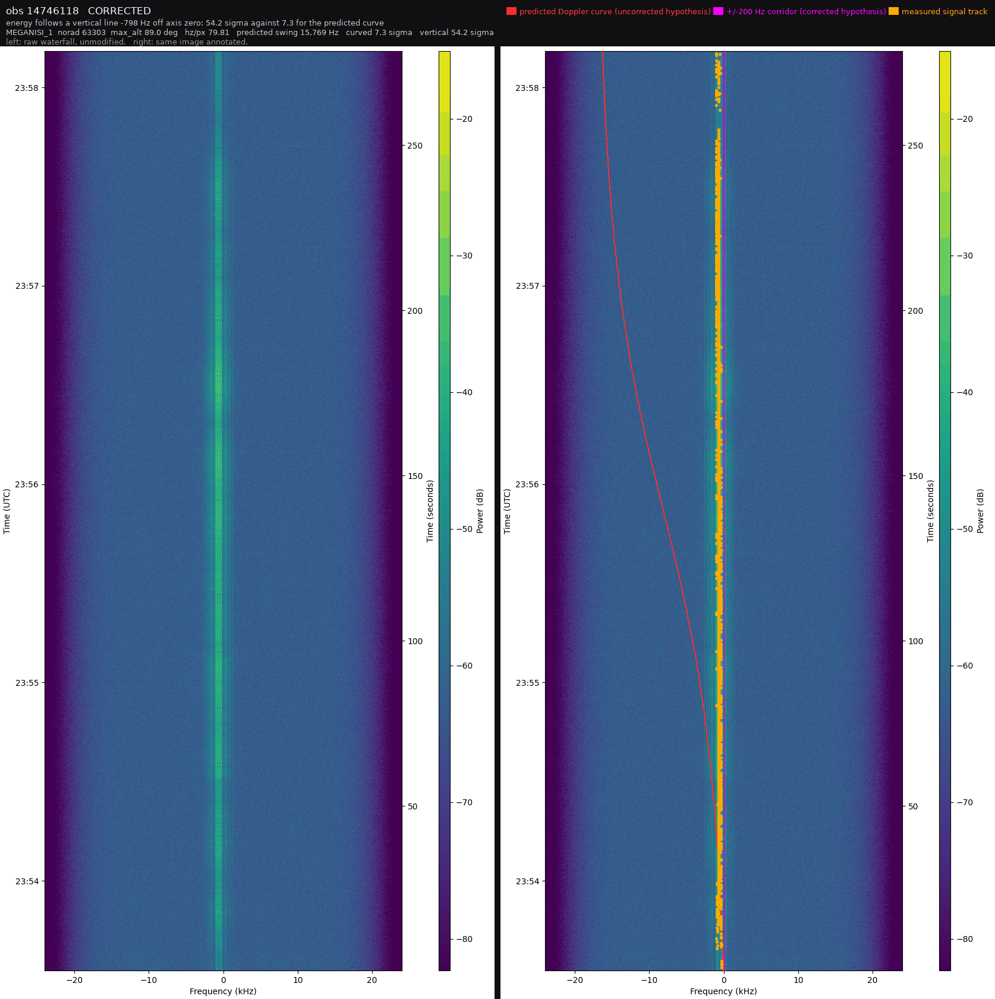
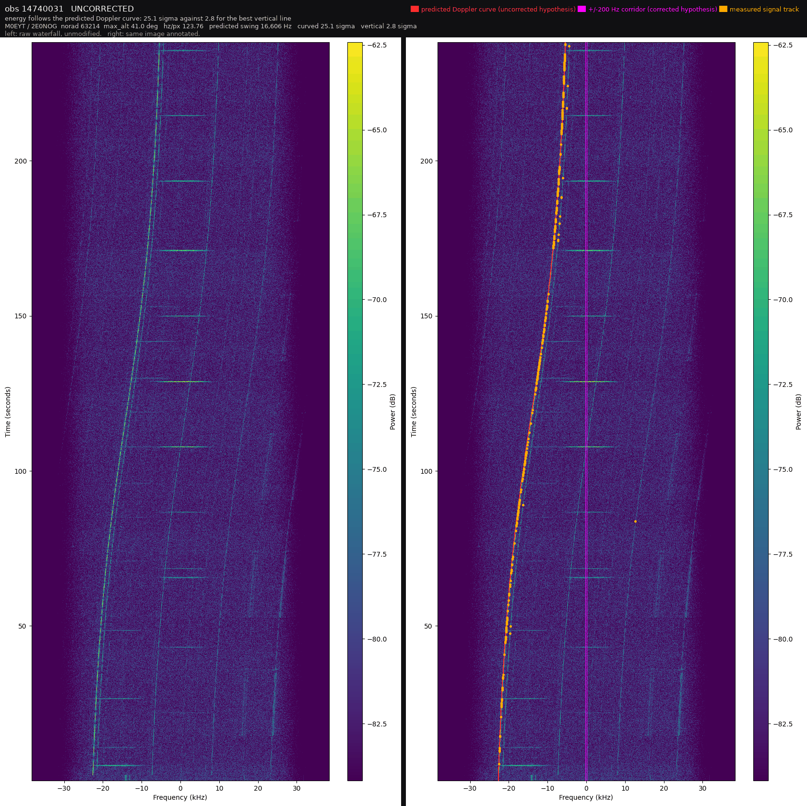

# TraceTriage

**A read-only, physics-conditioned review queue for public SatNOGS radio observations.**

SatNOGS is a network of volunteer ground stations that record satellites passing overhead
and publish every recording as a waterfall image. It produces far more of them than anyone
can look at: of 600 observations sampled from this snapshot, 426 carry no decisive human
verdict at all. TraceTriage reads the image and the orbital physics together, works out
which unreviewed observations would teach a reviewer the most, and puts them in order. It
writes nothing back. A human still decides.

Submitted to the AI Builders Challenge with IBM Bob, August 2026 theme: **Advance Space Exploration with AI**.

**Live console: <https://tracetriage.vercel.app/>.** A static export: no server, no
database, no credentials, and no measurement fetched from another origin. The site makes
exactly one third-party request, the Adobe Fonts stylesheet for two licensed display faces,
and nothing that carries a number depends on it: the console's
[provenance page](https://tracetriage.vercel.app/provenance/) names the host, measures
the bytes it costs, measures what it costs the first paint (956 ms against 152 ms with
the host blocked, because the kit sets `font-display: auto`) and lists both hosts in the
content security policy. Six pages: the review
queue, the evaluation with every gate including the ones that did not pass, the agent study
beside its control arm, the precedent study with the condition that takes its result away,
the baseline orderings the queue has to beat, and the provenance of each number.

**Judges start here: [`FOR_JUDGES.md`](FOR_JUDGES.md).** It maps each judged criterion to the
file that carries it, opens with the checks a judge can run in a few minutes each, and is
generated from the receipts by `scripts/sync_for_judges.py`, so it cannot drift from them.

[](https://github.com/Kesav2k04/tracetriage-august-2026/actions/workflows/ci.yml)
&nbsp;The badge runs the offline replay on a clean clone: see [Continuous integration](#continuous-integration).

<!-- generated by scripts/sync_readme_results.py: what it produced, do not edit -->
**What it produced.** Four things that can be opened rather than taken on trust. Every
figure below is read out of a receipt under `artifacts/` by the script that writes this
block, so none of it can drift from the study it came from.

- **A ranked review queue over 407 observations**, live on the console, each row carrying
  the reason it is there and the measured fields that reason was computed from. Nothing is
  written back to SatNOGS: the queue is a reading order, and a human decides.
- **An agent that answers questions about that evidence over MCP.** `granite3.1-dense:8b`,
  running locally at Q4_K_M and temperature 0, answers 22 of 24 correctly with five
  read-only tools and 2 of 24 with none. One-sided exact p = 1e-06 over 20 discordant
  pairs. The control arm is the point: the tools are measured, not demonstrated.
- **A grounding checker that refuses most of what the model writes.** Of 25 drafts, 11
  were emitted and 14 refused. Against 525 adversarial drafts it caught 525, and against
  175 clean ones it refused 0. A published sentence is one no rule could fault, not one
  the model was confident about.
- **A precedent search on `granite-embedding:278m`**, put head to head against seven
  standardised numbers under a condition built to take its advantage away, and reported
  indistinguishable in both. A result that went the other way is published the same size
  as one that did not.
<!-- end what it produced -->

<!-- generated by scripts/sync_readme_results.py: gate status, do not edit -->
**Status: six kill gates were written down before any of them was measured. Two asked
whether the project was feasible at all and were answered before the first line of
pipeline code. Of the four that ask whether the idea works, none passed on the split that
decides them, three came back inconclusive and one was never run.** Gate 6 does clear its
threshold on the held-out cold-station split, at 2.253x. That is reported, and it is not
substituted for the split the gate was pre-registered on.

**Feasibility, decided in advance.**

| # | Gate | Threshold | Verdict |
|---|---|---|---|
| 1 | Dataset volume and entity spread | ≥2,000 mature waterfalls, ≥12 transmitters, ≥30 stations | **PRE_PASSED** |
| 2 | Metadata coverage for the corridor | ≥80% of the sample computable | **PRE_PASSED** |

**Substantive, and the reason the rest of this file is worth reading.**

| # | Gate | Threshold | Verdict | What came back |
|---|---|---|---|---|
| 3 | Corridor intersects a visible trace | ≥70% of reviewed positives | **NOT_ESTABLISHED** | 3 of 3 testable observations discriminate, and the exact one-sided 95% lower bound on that rate is 0.368 |
| 4 | Blinded human decidability | ≥80% of a balanced sample decidable | **OPEN** | never run, so it carries no rate. The instrument exists: `scripts/build_gate4_worksheet.py` builds the blinded bundle and `artifacts/GATE4_RECEIPT.json` reads `NOT_RUN` |
| 5 | Physics beats image-only on Brier | strict improvement, chronological split | **NOT_ESTABLISHED** | margin +0.02079 on the shipped arm, 95% CI -0.01301 to +0.05036, which contains zero |
| 6 | Queue lift over random | ≥1.5x actionable conflicts at equal budget | **NOT_ESTABLISHED** | 1.582x, 95% CI [1.353, 1.740], which contains the threshold. On the held-out cold-station split the same queue **PASSED** at 2.253x |

An interval that spans a threshold is not a measurement of nothing. On the split gate 6
was pre-registered on, 0 of 2,000 random orderings of the same 87 observations found as
many actionable conflicts inside the review budget as this queue did, a permutation
p-value of 0.0005. The interval spans 1.5 because the scale is short: a budget of 50 over
87 observations holding 22 conflicts caps every possible ordering, a perfect oracle
included, at 1.740x. The gate is still not met, and the whole room any ordering had to
meet it in was 0.240 wide.

Inconclusive is reported as `NOT_ESTABLISHED` rather than rounded into a pass, and the gate
that was never run is reported as `OPEN` rather than omitted. Gate 3 was `PASSED` until
2026-08-18, when the rate it claimed was re-derived with an exact interval and moved to
`NOT_ESTABLISHED`; `docs/KILL_GATE.md` carries the entry rather than the history being
quietly rewritten.

Every number in this README is generated from a frozen artifact under `artifacts/` and
carries a row in `docs/CLAIM_REGISTER.md`. `tests/test_claim_drift.py` compares each quoted
value against the artifact it came from rather than merely checking a register row exists:
editing the AUC row from 0.875 to 0.999 turns three tests red. `tests/test_readme_claims.py`
does the same for the paths and images this file names, because an existence claim is as
checkable as a number.
<!-- end gate status -->

---

## Problem statement

The SatNOGS network publishes hundreds of thousands of ground-station radio observations of satellites. Each one produces a waterfall image, a spectrogram of received power over frequency and time. Volunteers review these by eye to decide whether a satellite was actually heard.

There are far more observations than there is human attention. In a 600-observation sample measured on 2026-08-16, **71% carried no decisive human waterfall verdict at all** (426/600 were `unknown`; see `docs/SATNOGS_API_RECON.md` section 5). The backlog is not a storage problem, it is an attention-allocation problem.

A student researcher or volunteer reviewer with a fixed budget of, say, forty minutes faces one concrete decision: **which observations, out of thousands, deserve those forty minutes?**

Reviewing in arrival order spends the budget on the easy and the already-obvious. What is worth a human's time is the subset where the evidence disagrees with itself: the image looks like signal but the orbital geometry says the satellite was below the horizon, or the network label says nothing was heard but a trace sits exactly where physics predicts it.

## Selected challenge theme

**Advance Space Exploration with AI.** The theme asks for solutions that turn data-heavy space operations into insight-driven ones and make space more accessible. SatNOGS is open, volunteer-run space infrastructure whose bottleneck is human review capacity. Spending scarce reviewer attention where it changes an outcome is directly that problem.

## Solution description

TraceTriage ranks a **read-only review queue** over observations that already exist. For each one it produces an evidence card showing:

- the waterfall image as published
- the **expected corrected-centre corridor**, the frequency band where a real signal from that satellite should appear, computed from the observation's own stored TLE, station coordinates, timing and receiver metadata
- the detected trace and its residual against that corridor
- artifact-quality checks
- the current SatNOGS label and where that label came from
- a calibrated confidence score, or an explicit **abstention with a reason code** when the evidence is not sufficient

The queue puts disagreement and uncertainty at the top, subject to duplicate control and station/transmitter diversity so a single noisy station cannot flood the budget.

**What this system will never do.** It does not vote on SatNOGS, does not change any public label, does not schedule or control a station, and does not hold a write credential. It does not claim confirmed satellite identity, decoded telemetry, mission success, or official endorsement. Local annotations stay local. The permission boundary is specified in `docs/ACTOR_AND_PERMISSION_CONTRACT.md` and enforced by test, not by convention.

The strongest statement this project is permitted to make, once and only once the evidence exists, is:

> On a frozen chronological sample of public SatNOGS observations, TraceTriage concentrated independently reviewable label or physics conflicts near the top of a fixed review budget while abstaining when the evidence was insufficient.

## AI approach and architecture

The design principle is that **every layer must earn its place through an ablation**. A component that does not improve calibration or queue utility gets deleted, not defended.


The diagram is generated by `scripts/build_architecture_diagram.py`, which refuses to draw
a box until the module and the receipt that box names both exist in the tree, and refuses to
draw an edge into a stage nothing produces. `scripts/gate.py` runs it with `--check`, so a
renamed stage fails the standing gate rather than leaving a picture that describes a pipeline
this repository no longer has. Its palette is read out of `apps/web/app/globals.css` rather
than retyped, for the same reason.

**Step by step, in the order it runs.** The diagram above is the shape; this is the
sequence, and every step writes a file that the next one reads.

1. **Snapshot.** `scripts/recon` pulls SatNOGS observation metadata and waterfall
   images through the public API and freezes them, recording a SHA-256 per file, the
   retrieval time, and the CC BY-SA 4.0 terms. Nothing downstream reaches the network.
   The snapshot id is printed on every page of the console.
2. **Contracts.** Each stage's output schema is written and ratified in `contracts/`
   before the script that writes against it runs. A receipt that violates its contract
   never reaches disk, so a malformed measurement cannot be published and noticed
   later. `schema_version` is pinned by `const`, so a receipt from an older script
   cannot validate as current.
3. **Physics.** `pipeline/tracetriage/physics.py` propagates each pass with SGP4 from
   the TLE that was current at the observation start, computes the Doppler curve from
   range rate, and maps it to pixel columns through the image's own frequency axis.
   Elevation is measured from the WGS-84 geodetic normal.
4. **Splits.** `pipeline/tracetriage/splits.py` builds four holdouts: chronological,
   cold-station, cold-transmitter, and cold on both at once. Each transmitter and each
   orbital revolution is confined to one partition. The combined split excludes rather
   than assigns the rows that would break its own guarantee, and states the count.
   Leakage checks fail the build if any check examined zero records.
5. **Features and the model ladder.** Centre-energy heuristic, then HOG with
   regularised logistic regression, then a corridor matched filter, then a fusion head
   over image plus metadata plus physics. Each rung is compared against the one below
   it with a grouped bootstrap, and a rung that does not improve on the last is
   dropped by the ablation rather than kept.
6. **Calibration and abstention.** Temperature or isotonic fitting on a later time
   period than training, then a selective-prediction curve so a risk ceiling can be
   traded against coverage.
7. **Queue.** `scripts/run_queue.py` ranks the test partition, deduplicates repeated
   observations of one pass episode, and measures lift against random, against
   first-in-first-out, and against an image-only uncertainty ordering at the same
   review budget. Intervals are bootstrapped over pass episodes and over ground
   stations, and the reported interval is the union of the two.
8. **Export and console.** `scripts/build_console_data.py` projects the receipts into
   the JSON files the site reads, refusing to substitute a null for a field it
   could not find. `apps/web` is a Next.js static export: no server, no database, no
   runtime fetch, no credentials.
9. **Reviewer note.** `pipeline/tracetriage/explain.py` builds a closed evidence packet of
   26 printed fields for one observation and nothing else: no image, no retrieval, no tool
   call. `pipeline/tracetriage/granite.py` sends it to a local IBM Granite model, the only
   HTTP write verb in this repository and one that refuses any destination that is not
   loopback. The checker then requires every numeric token in the draft to be one of the
   packet's own tokens, or to equal a packet value at the precision it was printed to under
   three unit conversions that each have to carry the unit they produce, and refuses any
   draft that asserts a confirmation, a detection, decoding, telemetry, proof or an
   absolute. A refused draft is not retried: the deterministic template ships and the card
   says which codes refused it.
10. **Evidence server.** `scripts/mcp_server.py` exposes the queue, one observation's
    packet, the gate verdicts, a receipt summary and the grounding checker itself as five
    read-only MCP tools over stdio, with no dependency outside the standard library. An
    agent writing about an observation can have its own prose checked by the same code that
    decides whether this project's generated notes ship.

11. **Agent, measured against a control.** `pipeline/tracetriage/agent.py` drives those five
    tools from the local Granite model over real stdio JSON-RPC, capped at
    6 steps, and `scripts/run_agent_study.py` puts
    24 questions to it twice: once with the tools and once with no tools at
    all. Ground truth comes from the files the console ships, by a different code path than
    the tools use, and every question is proved answerable in a single call before any model
    is graded on it. With the tools:
    **22 of 24 correct**, 95% interval
    [0.7602, 0.985]. Without them:
    **2 of 24**, with
    18 questions declined as unknown. Of the
    20 questions the two arms disagreed on, the tool arm was right
    on 20, which is an exact one-sided p of
    1e-06.

12. **Precedent, and the condition that breaks it.** `pipeline/tracetriage/precedent.py`
    retrieves the five most similar earlier passes for each of the
    739 decisively labelled observations, under four arms over one
    candidate pool: an IBM Granite embedding of the evidence card, seven standardised
    numbers under Euclidean distance, the station's own recent passes, and a uniform draw.
    Each arm runs twice. Warm allows any other observation. Cold forbids the query's own
    station, its own physical site and its own satellite, because in this corpus the
    outcome is partly a property of who recorded it. Warm, the embedding reaches
    **0.6181** agreement at 5 against a random arm at **0.5302**, a margin of 0.0880
    whose Bonferroni-adjusted interval [0.0338, 0.1558] clears zero. Cold, the same arm
    reaches **0.5543** against **0.5283**, and its adjusted interval [-0.0353, 0.0998]
    does not. The drop between the two conditions is itself a comparison and is measured
    as one, paired per query: 0.0639, adjusted interval [0.0160, 0.1182], which excludes
    zero. The warm number is the one a demo would show and the cold number is the one
    that answers the question, so the console page carries both columns at the same
    weight.

    The site clause is there because the station clause was not enough. Nine sites in
    this pool run between two and four station ids from the same coordinates, so
    "a different station" was satisfied by the same dish on the same roof, and 22.76% of
    the embedding's cold neighbours came from the query's own site against 0.89% for a
    random draw. Excluding the site removes 4,238 query-candidate pairs the id rule left
    in, and it costs the cold result: the margin falls from 0.0398 to 0.0260.

**Model ladder**, each rung compared against the last: centre-energy heuristic, HOG plus regularised logistic regression, a frozen MobileNetV3-Small or ResNet18 encoder, a physics-only residual model, then a fusion head over image plus metadata plus physics. Calibration by temperature or isotonic fitting on a later time period. Selective or conformal abstention on top.

**Evaluation is grouped, never random.** Random image splits leak station, satellite and rendering patterns. Holdouts are chronological, cold-station, cold-transmitter, and combined cold-station-and-transmitter, with each transmitter and orbital revolution confined to a single split. Bootstrap intervals are computed over orbital episodes or days, not image rows.

**Labels are silver, not truth.** `waterfall_status` supplies weak supervision. Unknowns stay unlabelled rather than being coerced into a negative class. A blinded local audit with separate artifact, visible-signal and target-consistency axes decides the evaluation target.

**IBM Granite writes the reviewer's first sentence, and a checker refuses most of what it
writes.** Granite 3.1 dense 8B runs locally at Q4_K_M, temperature zero, and drafts one note
per card from the evidence packet described in step 9. Of 25 cards, 11 drafts were accepted
and 14 refused, and every refusal was an ungrounded number. In **9 of the 25** the model
wrote a downlink frequency in megahertz that was not this observation's, wrong by 10 kHz to
1215 kHz. Each invented value lands within five percent of that observation's real downlink,
which is the finding's own definition and also what makes it dangerous: the number looks
like the number that belongs there, in a sentence that reads like the rest of the card. An
earlier version of this paragraph called all nine real amateur satellite frequencies. Four
are not: two sit in the 137 MHz meteorological downlink band and two at 401 MHz. The claim
that survives is proximity to the truth, which the receipt measures, rather than membership
of a band, which it does not.

The checker is measured in both directions, because one direction alone is worthless: a
checker that refuses everything catches every adversarial draft. The suite is 21 drafts
built to break exactly one rule each, and 7 that break none, checked against every one of
the 25 observations' packets: **525 of 525** adversarial checks were refused for the reason
they were built to trip and **0 of 175** clean checks were refused. Detection requires the
expected violation code rather than merely a refusal. The counts are checks rather than
distinct drafts, and the receipt publishes the per-observation figures beside the totals so
neither can be read as the other. All of it is in `artifacts/EXPLAIN_RECEIPT.json`.

Generation turned out not to be reproducible, and the first version of this layer assumed it
was. Same prompt, same weights, temperature zero, fixed seed: 36 percent of drafts differed
on a repeat inside one process and 56 percent differed in a fresh process after a model
unload, with about one repeat in nine crossing the checker's accept-or-refuse decision. One
freeze produced no differences at all over 75 repeats, so the instability is itself variable
and cannot be retried away. The consequence is architectural: the text a reviewer sees is
frozen into `tests/fixtures/granite_notes.json` and committed, the publisher needs no model
and no network, and the disagreement rate is published beside the notes rather than smoothed
over.

**What was scoped for Granite and was not built.** The plan also called for a local Granite
model translating a bounded natural-language request into typed queue filters, with a plain
form as the primary control and three conditions for removal. None of that shipped. The
queue's filters are a plain form, which is what the plan called the primary control.

**What the agent study does and does not settle.** Every number in every tool-arm answer
appeared in something the agent had actually read (24 of
24), and the control invented three. The two tool-arm failures are
published as two different shapes rather than one rate: one question where the value was in
front of it and it answered from a neighbouring field, and one where it never fetched the value
at all. What it does not settle is whether the answers are useful. These are lookups with a
single correct token, chosen so grading is mechanical, and a reviewer's real question is not.

**What none of this measures.** Whether an accepted note is useful. Grounding is a property
of the numbers in a sentence, not of the sentence being worth reading, and nothing here asks
a reviewer. Kill gate 4's blinded study is the instrument for that and it is still OPEN. The
instrument itself now exists: `scripts/build_gate4_worksheet.py` builds a blinded bundle whose
sample is committed to in advance as one salted sha256 per item, and `scripts/score_gate4.py`
scores the filled form. `artifacts/GATE4_RECEIPT.json` reads `NOT_RUN`, which is a fourth
outcome beside passed, failed and inconclusive, and it carries no rate.

## How IBM Bob was used

IBM Bob is the primary development tool for this project and builds every load-bearing subsystem: ingestion, physics, model interface, calibration, abstention, ranking, the evidence console, the test suite, and final release acceptance.

Bob's work is recorded, not asserted:

- `docs/BOB_BUILD_LOG.md` maps each Bob task to files, commits, tests, failures and repairs, with actual build credit consumption
- `docs/BOB_HANDOFF.md` carries exact state across trial-account rotations
- `.bob/rules.md`, `.bob/TOOL_SPECS.md` and `.bob/mcp.json` are the standing instructions, tool contracts and MCP wiring each Bob task ran under, tracked so the conditions of the work are readable and not just its output. The specification separates the five tools that exist from the five that were specified and were not, naming for each of those the script that did its job instead, and a test fails if the registration ever points at a server that is not there
- exported task transcripts are **not included**. An earlier draft of this section said they were, pointing at a directory that held nothing but a placeholder file, which git does not publish at all. The directory is gone and the build log is the record; a test now fails if this file names a path that is missing or empty
- a final Bob task inspects the release commit, runs the acceptance suite, repairs failures
  and generates a sign-off receipt. `scripts/signoff.py` runs ten checks at one commit and
  writes `artifacts/SIGNOFF_RECEIPT.json` naming each one, its command, its exit code and a
  line of its output. It has three outcomes rather than two: a check that could not run in
  that environment is `NOT_CHECKED` with a stated reason, and the verdict refuses to sign
  while any check has failed

`docs/PRE_BUILD_BASELINE.md` lists exactly what existed before Bob's first task, so the line between scaffolding and Bob's work is auditable rather than implied.

## The IBM stack, and where each piece is

Five IBM technologies carry load here. Each row names the file a judge can open to check it.

| Piece | What it does | Where |
|---|---|---|
| IBM Bob | Primary development tool. Builds ingestion, physics, the model interface, calibration, abstention, ranking, the console, the test suite and the release sign-off | `docs/BOB_BUILD_LOG.md`, `.bob/rules.md`, `.bob/TOOL_SPECS.md`, `.bob/mcp.json` |
| IBM Granite 3.1 dense 8B | Writes the reviewer's first sentence, locally, at Q4_K_M and temperature zero. Every draft goes through a grounding checker that refuses more than it accepts | `pipeline/tracetriage/granite.py`, `artifacts/EXPLAIN_RECEIPT.json` |
| IBM Granite embedding 278m | Embeds each evidence card for the precedent study, where it is measured head to head against seven standardised numbers and comes back indistinguishable | `pipeline/tracetriage/precedent.py`, `artifacts/PRECEDENT_RECEIPT.json` |
| IBM Carbon | The console's design system, and it owns the structure: the Gray 100 lightness ramp, the type scale, the 8px spacing steps and the productive motion curves, written as custom properties rather than pulled in as a component library | `apps/web/app/globals.css` |
| IBM Plex | Sans and Mono, self-hosted from this origin, latin subset, three weights. Every face that carries a measurement is Plex and is served from here. The two licensed display faces sit in front of a Plex fallback and come from Adobe Fonts, which is the one third-party host this site requests | `apps/web/app/layout.tsx`, `@fontsource/ibm-plex-sans`, `@fontsource/ibm-plex-mono` |

Two of those rows are results rather than choices. Granite's drafts are refused more often
than they are accepted, and the embedding does not beat seven numbers; both are reported
above with their intervals rather than left out because they are unflattering.

### The palette is derived from the data, and the derivation is checkable

Carbon owns the structure and nothing below moves it. Colour is a separate question, and it
was answered from a measurement rather than from taste.

Start with the input. Every waterfall this site publishes is greyscale: across the 25
committed images the largest difference between any pixel's brightest and darkest channel is
1 part in 255, and the mean is 0.01. The instrument records intensity and no hue.
`tests/test_hero_window.py::test_every_published_waterfall_is_achromatic` asserts it, so the
claim cannot quietly stop being true when the snapshot is refreshed.

That decides the palette in one rule: **grey is measured, colour is computed.** The waterfall
is shown as published, in grey. Every coloured mark on the page is something the pipeline
derived, a corridor predicted from an orbit or a conflict between two labels, so a reader can
separate the observation from the inference without reading a legend.

**The neutrals are Carbon's, re-tinted.** Each one is its Carbon Gray 100 original converted
to OKLCH, held at exactly its Carbon lightness, given a chroma that falls as lightness rises
(0.030 in the darkest steps, 0.004 in the lightest) at hue 305, and converted back. Because
OKLCH lightness is perceptually uniform and the chroma is small, the hue rotation moves the
largest ratio on the ramp by 0.026, which is rounding. One lightness did move, the page
ground, from Carbon's L 0.200 to L 0.182, and a darker ground can only raise a ratio measured
against it: `text-01` on the page ground is 16.45:1 as Carbon ships it and 17.11:1 here,
`text-03` on a rule is 3.49:1 and 3.50:1, and `ui-04` as a component boundary is 3.60:1 and
3.73:1. All 26 pairs meet their floor. The tint was done this way instead of by picking
colours that looked right so that no accessibility result measured on the built site had to
be re-argued, and the chroma falls with lightness for a reason worth stating: a tinted
mid-grey is what makes a dark theme look synthetic, while a tinted black reads as a sky, so
the void carries the colour and the ink carries almost none. Hue 305 is a deep plum, and it is the one colour on the
page that is a preference rather than a derivation. It is named as such in `globals.css`.

**The accents are stops off the colourmap the plate is rendered through.** The home page maps
its greyscale plate through `inferno` in an SVG filter, using the same 17-stop table
matplotlib generates, and every accent token is a sample off that same table with the
position it was taken from written beside it. `--link-01` is inferno at 0.80, `#fca50a`,
measuring 9.46:1 on the page ground and 7.69:1 on a tile. Inferno was chosen for three
properties rather than for its look: it is monotonic in lightness, so a value encoded by hue
is also encoded by contrast; it is safe under all three common colour-vision deficiencies,
which a blue-to-red ramp is not; and it is what matplotlib ships for spectrograms, which is
what a waterfall is.

**One verdict carries a hue, and it is red.** Two of the four substantive gates came back
neither passed nor failed, so a red and green pair would say something the measurements do
not. NASA's Appendix F display standard reserves red for a warning and amber for a caution,
and Carbon's own guidance assigns grey to unknown or pending; between them they rule out
painting a cleared gate in the brightest thing the ramp has, because that is yellow and
yellow is a statement about the subject of the measurement rather than about the measurement.
So `PASSED` is the page's strongest neutral, and the four states are told apart by the
marker's form as well as its value: a filled disc for decided, a hollow ring for measured and
inconclusive, a dash for no measurement at all. The verdict word is printed in capitals
beside every one of them, so hue is never the only channel carrying the state.

**What was wrong before.** `globals.css` used to say `--verdict-passed` was chosen to sit in
the same family as the viridis ramp the waterfalls are rendered in. The waterfalls are not
rendered in viridis. They are grey, and the ramp was being applied by the console rather than
found in the data, so a documented rationale rested on a false premise about its own input.
The note is recorded in the stylesheet rather than deleted.

**Two checks hold it.** `scripts/check_contrast.py` recomputes all 26 rendered pairs from the
token block and `tests/test_contrast.py` fails the suite if one drops below its floor, so the
next person to reach for a nicer amber finds out immediately rather than at an accessibility
audit. `apps/web/audit/a11y-probe.js` measures the built pages instead of the tokens: over
seven page types it resolves the real background behind 2,235 text nodes and reports 0 below
requirement, 193 focusable elements with 0 missing a focus ring, one `h1` per page, no
skipped heading level and no unlabelled media element.

That probe found a defect in this repository and it is worth stating plainly. The page ground
had become a gradient set through the `background` shorthand, which resets `background-color`
to transparent, so neither `body` nor `html` carried an opaque colour anywhere. The probe's
walk for a background found none, fell back to inventing white, and reported 662 of 706 nodes
on the landing page below their contrast floor against a page that renders correctly. The
earlier run recorded in the claim register was measured before that gradient existed, and the
gradient silently invalidated it. The fix is three parts: the ground now carries an opaque
colour under the gradient, which is the gradient's own first stop so no pixel moves; the probe
reports an unresolvable background as a third outcome rather than scoring it either way; and a
background layer sized to zero on an axis is treated as painting nothing, because the hover
underline is a gradient held at `0%` until hover and treating that as an obstruction made 41
links on one page unmeasurable.

Two real contrast failures came out of the same run, both the same mistake in two places:
white text on the accent. The skip link measured 3.34:1 on the old Carbon blue, already under
its floor and unnoticed because the link is invisible until focused, and the queue's active
filter chip measured 2.00:1 on the amber. Both now carry the plate's ground as their ink,
which is the same pair inverted at 9.09:1.

### Motion costs no JavaScript

The reveal on scroll is `animation-timeline: view()`, the row stagger is an `animation-delay`
multiplied by a row index, and the digit wipe is a `clip-path` inset. All three run on the
compositor, none needs an observer or a listener, and the static export animates without
shipping a frame of script. Only opacity, transform and clip-path are animated, so nothing
costs a layout or repaints a subtree. Where `animation-timeline` is unsupported the
`@supports` block does not apply and every element renders at its final state, which is the
right fallback: the content is the information and the reveal is not.

`prefers-reduced-motion: reduce` collapses every duration, and each rule is additionally
scoped to `no-preference`, so a reader who asked for less motion never has an element start at
zero opacity and then depend on an animation to arrive. `apps/web/audit/motion-probe.js`
measures both failure modes a build cannot see: it reports the count the selector reached and
every element that did not end fully opaque after a full scroll. A matched count of zero is
reported as a failure rather than as a clean run, and it caught one. The reveal was first
written `main > section` while every section is a child of `.shell`, so it matched nothing at
all and the page had no reveal while the stylesheet looked correct.

## Would it keep up with the network?

The judged criteria ask about practicality and scalability, and that question has one
honest form: does the thing keep up with what SatNOGS actually produces? Every number
below is computed by `scripts/measure_throughput.py` from artifacts already in this
repository and written to `artifacts/THROUGHPUT_RECEIPT.json`, and `scripts/gate.py`
re-runs it with `--check`.

| | Measured | Where it comes from |
|---|---|---|
| What the network produces | **6,380 observations with a waterfall per day** | the capture time each station wrote into its own object key, over 2,500 stored waterfalls spanning 9.40 hours |
| What one observation costs | **1.2576 s**, single-threaded, at the dominant stage | `artifacts/corridor_features.json`: 743 observations in 934.4 s |
| What one core therefore handles | **68,702 observations per day** | the two above, divided |
| Headroom | **10.77x on one core** | 68,702 against 6,380 |
| What ingestion costs | **1.8197 s per observation**, wall clock | `artifacts/DATASET_MANIFEST.json`: 110 API pages and 2,500 image downloads between `built_at` and `completed_at` |

**The interesting number is the last one.** Fetching an observation costs 1.45 times what
processing it does, and that cost is a 0.4-second courtesy interval between API requests
plus a 1.7 MB image download. Neither is a property of this pipeline. This is not a
project whose constraint is inference, which also names its deployment: run at the ground
station, where the waterfall is already on disk and there is no public API to be polite
to. The corridor fit is independent per observation, so the same figure holds per core.

**Four things that measurement does not cover**, stated because a scalability claim with
no boundary is not a measurement:

1. The capture span is 9.40 hours inside a single day. A day rate extrapolated from it is
   one observation of the network's rate rather than a long-run average, and SatNOGS
   volume moves with how many stations are online.
2. The 1.2576 s covers the corridor fit and the second-trace survey. SGP4 propagation,
   the fusion head's forward pass and the queue sort are all cheaper per observation and
   are not in it. Granite is not in it either, and is not per observation: it runs on
   what a reviewer opens.
3. Both stages were timed on one machine, single-threaded. The core count is a division,
   not a measured parallel speed-up.
4. Nothing here is a latency claim. The queue is a batch reading order and no part of
   this project has to answer inside a pass.

## Measured results

### Established, with receipts

These are generated from frozen artifacts and registered in `docs/CLAIM_REGISTER.md`.

| Metric | Value | Receipt |
|---|---|---|
| Corrected and uncorrected captures both occur | 4 corrected, 3 uncorrected, 17 undecidable, of 24 vetted `with-signal` observations | `artifacts/a3_overlays/summary.json` |
| Metadata cannot reveal correction status | `doppler-correction-per-sec` null and `rigctl-port` `4532` on 24 of 24, in both groups | `artifacts/a3_overlays/summary.json` |
| Strongest corrected match | vertical carrier at 54.2 sigma against 7.3 for the swept curve | `artifacts/a3_overlays/overlay_14746118.png` |
| Strongest uncorrected match | swept curve at 25.1 sigma against 2.8 for the best vertical line | `artifacts/a3_overlays/overlay_14740031.png` |
| Observations with no measurable narrowband trace | 17 of 24 vetted `with-signal`, scoring 0.7 to 3.5 sigma | `artifacts/a3_overlays/summary.json` |
| Pass geometry against reported max_altitude | median 0.22 deg, p99 0.53 deg, 99.5% within 1 deg, 199 of 200. The reference is integer-valued on all 200 records, so this bounds the error near half a degree and resolves nothing finer | `artifacts/PHYSICS_VALIDATION.json` |
| Pass azimuth against reported rise and set azimuth | median 0.27 deg at rise and 0.27 deg at set, max 1.96 deg, 100% within 3 deg, on an unrounded reference. Swapping the atan2 arguments gives 93.9 deg and mirroring the azimuth gives 27.0 deg | `artifacts/PHYSICS_VALIDATION.json` |
| Frequency axis direction, re-measured per observation | the shipped convention wins on all 3 observations where it is measurable; the other 4 are corrected passes whose flat corridor cannot orient an axis at all. It was measured on 2 of the 20 client families in the dataset. The constant applies where a waterfall was rendered, which is 2,500 of the 2,727 stored observations: 1,004 of those come from a measured family and 1,496 inherit it. Over all 2,727 rows the figures are 1,023 and 1,704, and both pairs are published because the second counts 227 observations with no image | `artifacts/GATE3_RECEIPT.json` |

The first two are the reason this project exists. A reviewer cannot tell from an
observation record whether its waterfall was Doppler corrected, the two cases
produce completely different expected traces, and the difference is measurable
from the image. That gap between what the record says and what the image
supports is what TraceTriage ranks on.

Both rows below are published SatNOGS waterfalls, unmodified on the left and annotated on
the right by `scripts/a3_doppler_investigation.py`. The record cannot tell them apart. The image
can.

<table>
<tr>
<td width="50%"></td>
<td width="50%"></td>
</tr>
<tr>
<td><b>14746118, corrected.</b> The trace is a straight vertical line: 54.2 sigma against
7.3 for the swept curve. The station's software had already removed the Doppler shift
before writing the image, and nothing in the observation record says so.</td>
<td><b>14740031, uncorrected.</b> The trace follows the predicted curve across about 16 kHz:
25.1 sigma against 2.8 for the best vertical line. The same fields, the same client,
the opposite convention.</td>
</tr>
</table>

A detector that assumes one of these two shapes is wrong on the other half of the corpus,
and the observation record gives it no way to choose. That is the gap this queue ranks on.

Full method, margins and open questions: **`docs/DOPPLER_CORRECTION_FINDING.md`**.

### Measured, with receipts

Every cell below is read from a receipt under `artifacts/` and registered in
`docs/CLAIM_REGISTER.md`. Of the 6 kill gates, 2 were met, 3 came back inconclusive and 1
was never run. The rows for the gates that produced no number say so rather than being
left out.

| Metric | Value | Receipt |
|---|---|---|
| Brier score, chronological holdout | 0.1292 for the shipped arm, against 0.1495 image-only and 0.2085 for a prior-only floor | `artifacts/FUSION_RECEIPT.json` |
| AUC, chronological holdout | 0.875, against 0.842 image-only | `artifacts/FUSION_RECEIPT.json` |
| Calibration slope and intercept | 1.483 and -0.246, ECE 0.0713 | `artifacts/FUSION_RECEIPT.json` |
| Selective risk near 80% coverage | 0.0857 at 79.5% coverage | `artifacts/FUSION_RECEIPT.json` |
| Queue lift over random, chronological | 1.582x, 95% CI [1.353, 1.740], **NOT_ESTABLISHED** against a 1.5x threshold | `artifacts/QUEUE_RECEIPT.json` |
| Queue lift over image-only uncertainty | 1.582x against 1.186x at the same budget | `artifacts/QUEUE_RECEIPT.json` |
| Queue lift over first-in-first-out | 1.582x against 1.107x | `artifacts/QUEUE_RECEIPT.json` |
| Cold-station holdout | **PASSED**, 2.253x, 95% CI [1.920, 3.859] | `artifacts/QUEUE_RECEIPT.json` |
| Cold-transmitter holdout | 1.656x, 95% CI [1.336, 1.894], NOT_ESTABLISHED | `artifacts/QUEUE_RECEIPT.json` |
| Cold station and transmitter together | 1.292x, 95% CI [1.073, 1.520], NOT_ESTABLISHED | `artifacts/QUEUE_RECEIPT.json` |
| Physics beats image-only on Brier | **NOT ESTABLISHED**. Margin +0.02079, interval spans zero | `artifacts/FUSION_RECEIPT.json` gate5 |
| Shipped ranker against what the ablation recommends | They disagree. The queue ranks with `image_corridor` and the corrected rule recommends `image_only`. The block without corrected support is `corridor`, kept because the same arm's risk-coverage margin is +0.05736 with a corrected interval of +0.01192 to +0.11887, which does clear zero | `artifacts/FUSION_RECEIPT.json` ablation_conclusion |
| Granite text embedding against seven standardised numbers | Indistinguishable in both conditions. Warm margin +0.0260, adjusted interval [-0.0169, +0.0660]; cold margin +0.0168, [-0.0406, +0.0783]. Both span zero over 739 queries resampled by 116 ground stations | `artifacts/PRECEDENT_RECEIPT.json` |

### Still unmeasured, and named as such

| Metric | Value | Why |
|---|---|---|
| Human minutes per confirmed finding | `[UNMEASURED]` | Kill gate 4, the blinded human decidability study, was never run. Any number here would be an estimate wearing a measurement's clothes. |
| Blinded human decidability rate | `[UNMEASURED]` | Kill gate 4 again, and it is the gate itself rather than a derived quantity. The console reports gate 4 as OPEN rather than as a value, and the gate tally counts it as not met. |

### What the queue's own construction guarantees

The ranking score and the definition of a conflict are not independent, and the size of
that problem is measured rather than described. The score is 0.40 x disagreement + 0.35 x
safe offset magnitude + 0.15 x flat-row fraction + 0.10 x ensemble uncertainty, and the
three conflict criteria threshold the first three of those same quantities. 90% of the
score's weight sits on quantities the definition names and 75% on quantities a conflict in
this corpus is actually defined from, the gap being DEAD_CAPTURE, which fires on nothing
here. Either way a lift above 1.0 is close to guaranteed by construction.
`scripts/run_circularity_check.py` bounds it from `artifacts/CIRCULARITY_RECEIPT.json`,
reading the queue receipt and nothing else: no snapshot, no network, no model. It
reproduces the published 1.5818x from that file before computing anything.

| Question | Answer |
|---|---|
| What is the most any ordering could score here? | 1.740x. A budget of 50 over 87 observations holding 22 conflicts caps a perfect oracle there, so the whole distance between the 1.5x threshold and perfection is 0.240 |
| How much of that did the queue get? | 20 of the 22 an oracle would have found, which is 91% of the ceiling |
| What happens with the model taken out of the target? | 1.557x, 95% CI [1.264, 1.740], **NOT_ESTABLISHED**, counting only the 19 conflicts flagged by the two criteria the model does not enter, of which DEAD_CAPTURE flags nothing here, so the restriction reduces to one criterion |
| And with only the model's own disagreement? | 1.740x over 3 conflicts, reported as **NOT_INFORMATIVE** rather than as a pass: the queue found all 3 inside the budget, and a saturated lift equals population over budget whatever the count was |
| How often does a random ordering match the queue? | 0 times in 2,000 seeded shuffles of the same population, a permutation p-value of 0.0005, which is the smallest this test can report at 2,000 permutations |
| Does the statistic score a shuffle at 1.0? | 0.9992 over the same 2,000 permutations, 5th to 95th percentile 0.712 to 1.265. Each one is scored by `compute_lift`, the function gate 6 itself is measured with, so a defect in it moves this number |
| Which split has the least room to be measured in? | `cold_combined`: 20 conflicts in 76 observations at a budget of 50 caps every ordering at 1.520x against a 1.5x bar. That is 0.020 of room and a published **NOT_ESTABLISHED**, so its verdict is a fact about the budget and the receipt marks it not informative |

That the queue generalises. Restricting the target to the criteria the model does not
enter removes one loop and leaves another: on this corpus that restriction reduces to
STALE_CATALOGUE_FREQ alone, whose defining quantity the score weights at 0.35. The other
model-independent criterion, DEAD_CAPTURE, fires on nothing in this corpus, so a reader
following its 0.15 weight is following a loop that does not exist in the data. The honest
reading is that this measurement is a check on internal consistency and on the size of the
space the gate was set in, not an independent test of the ranking.

The queue's headline result is inconclusive, and that is the honest reading:
1.582x is above the 1.5x threshold as a point estimate,
but its interval contains 1.5, so the evidence does not exclude a queue that clears the
bar by nothing. It also sits entirely above 1.0, so the ranking is not nothing either.
The cold-station split, the one where a reviewer meets stations the model never trained
on, does clear the threshold. It does not substitute for the primary split and is not
presented as if it did.

## Setup

Requires Python 3.12 and Node 22, and [uv](https://docs.astral.sh/uv/). Nothing else: no
service, no key, no model download for the judged path.

The `full` extra is what the judged path needs, and it is an extra rather than a base
dependency so that the base install is 166 MB instead of 4,643 MB. Reproducing the
receipts wants all of it; measuring one live observation wants none of it.

```bash
uv venv --python 3.12 .venv
uv pip install --python .venv/bin/python -e ".[full,dev,onnx]"   # .venv/Scripts/python.exe on Windows
.venv/bin/python -m pytest -m "not network and not ocr and not llm"
```

The console is separate and needs no Python:

```bash
cd apps/web && npm ci && npm run build
```

Commands elsewhere in this repository are written with the Windows interpreter path
`.venv/Scripts/python.exe`, because that is the machine they were run and recorded on.
`.venv/bin/python` is the same interpreter everywhere else. `.github/workflows/ci.yml` runs
the whole path on Ubuntu, which is the version to copy if the paths here do not match your
shell.

The offline replay path must work with networking disabled. The gate that proves it is
`pytest -m "not network and not ocr and not llm"`: `ocr` needs a system binary and `llm`
needs the local model runtime, and neither is available on a clean runner, so a run that
included them would fail for reasons that say nothing about the replay path. Everything that
publishes a number runs in that gate.

The reviewer notes need the model only to be re-frozen. `scripts/run_explanations.py
--freeze` is the step that talks to it; the default run publishes from the committed fixture
and needs neither the model nor the network.

## Point your own agent at it

Two MCP servers and a CLI, no credential for either. `docs/USE_WITH_YOUR_AGENT.md` is the
whole thing in a page, with the config block for Claude Code, Claude Desktop, Cursor, Windsurf
and Zed, and the four lines that drive the server by hand when a config is wrong.

```bash
git clone https://github.com/Kesav2k04/tracetriage-august-2026
cd tracetriage-august-2026
pip install -e .
tracetriage triage 14740031          # measure an observation recorded today
tracetriage station 1696 --budget 6  # a station's own frequency error, across satellites
```

| Surface | Answers from | Tools |
|---|---|---|
| `tracetriage-live` | the public SatNOGS API, now | `live_triage_observation`, `live_list_observations`, `live_rank_observations` |
| `tracetriage-evidence` | the receipts committed in this repository | 5 read-only tools, offline, enforced by parsing its own imports |

`.mcp.json` at the root registers both, so a client opened on a clone of this repository has
them with nothing to configure. The live tools carry the `live_` prefix because a number
measured this minute and a number this project was scored on must not be confusable by an
agent reading a tool result.

The base install is 166 MB and answers in Hz, because the frequency axis is read by a template
matcher over rendered digits rather than a neural model. `full` adds easyocr and torch and is
needed to reproduce the frozen receipts, not to measure something new.

## Continuous integration

`.github/workflows/ci.yml` is the offline replay written out as a claim a runner tests. On
every push to `main` it builds the pinned environment on a clean Ubuntu clone, runs the suite
with every network-marked test excluded, regenerates the README results table and the judges'
page from the receipts and fails on any difference, scans for credential-shaped strings, then
typechecks, unit-tests and builds the console. A second job runs the live SatNOGS API tests
and is marked informational: an upstream API change should surface somewhere, and it must
never block the offline gate.

The badge at the top of this file reports the last run on `main`.

## Generated documentation

Five documents in this repository are produced by a script and fail the standing gate when
they drift from what produced them. Editing any of them by hand is the defect they exist to
catch.

| Document | Generator | What it is |
|---|---|---|
| `README.md` results tables and the gate status block at the top | `scripts/sync_readme_results.py` | the verdicts and the measured rows, from the receipts |
| `docs/KILL_GATE.md` | `scripts/sync_kill_gate.py` | the gate summary and the failure log |
| `FOR_JUDGES.md` | `scripts/sync_for_judges.py` | the submission page, from the receipts |
| `docs/REFERENCE.md` | `scripts/sync_docs.py` | what writes each artifact, what validates it, what tests name it |
| `docs/DEMO_SCRIPT.md` | `scripts/sync_demo.py` | the video shot list, with every spoken number read from a receipt |

Each takes `--check`, which regenerates into memory and exits non-zero on any difference
without writing. `scripts/gate.py` runs all five.

Three more things are generated and checked the same way without being documents.
`apps/web/public/data/` is written in its entirety by `scripts/build_console_data.py`, so the
console cannot show a number the receipts do not carry, and `scripts/check_artifact_freshness.py`
rebuilds every published payload into a scratch directory and diffs it.
`artifacts/CIRCULARITY_RECEIPT.json` is recomputed from `artifacts/QUEUE_RECEIPT.json` by
`scripts/run_circularity_check.py --check`, because a bound on a measurement goes stale the
moment the measurement is re-run. And `apps/web/public/og.png`, the card a pasted link
renders as, is drawn from the queue and circularity receipts by `scripts/build_og_image.py`,
so the two verdicts on it are the two the console holds: it is the one published surface
nobody looks at while working, which is exactly where a stale number survives.

## Prior art and honest scope

SatNOGS already assigns observation and waterfall statuses. Public projects already classify waterfalls with CNNs. STRF-based tooling already extracts Doppler traces. **TraceTriage claims novelty for none of those.**

The contribution it must defend, through six ablations documented in `docs/PRIOR_ART_BASELINES.md`, is the combination of calibrated selective prediction, expected residual geometry fused with image evidence, explicit label-provenance and disagreement analysis, queue ranking by measured review value, per-observation evidence receipts, and evaluation by findings per fixed review budget under temporal and entity holdouts.

If the physics does not improve probability quality, or the queue does not beat random ordering at the same budget, the correct outcome is to stop and document the failure. See `docs/KILL_GATE.md`.

## Licence

Code: MIT, see `LICENSE`.
SatNOGS data and derived artifacts: CC BY-SA 4.0, see `DATA_LICENSE.md`.

Author: Kesav2k04 <kesavk659@gmail.com>
